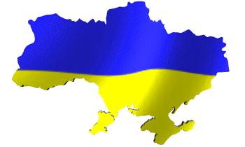
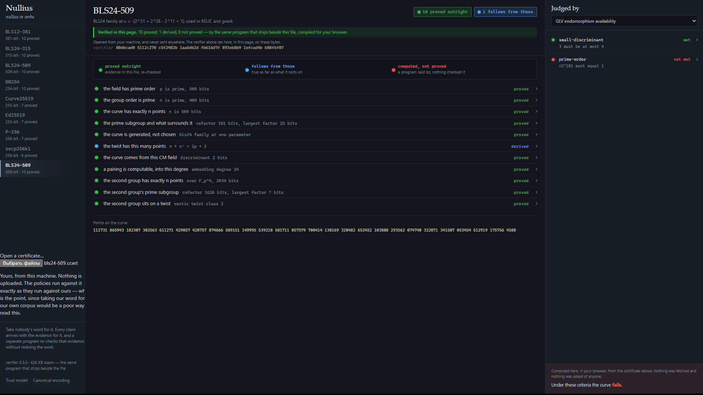

<div align="center">

# Nullius

**Machine-checkable certificates for elliptic curves**

*Nullius in verba* — take nobody's word for it

[](https://github.com/egorrushka/nullius/actions/workflows/ci.yml)
[](LICENSE)
[](spec/vectors/valid)
[](verifier/src)



🇺🇦 &nbsp;**Made in Ukraine**



</div>

---

**What this is.** A tool that turns claims about an elliptic curve —
"prime order", "large discriminant", "parameters from a seed" — into a
certificate that anyone can re-check, instead of a table you have to take
on faith. Each claim travels with the evidence for it, and a small
independent verifier re-establishes every claim from the file alone, in a
fraction of a second, on a machine that did none of the original work.

**Who it is for.** People who decide which curves go into real systems and
would rather verify than trust: cryptographers presenting a curve,
implementers vetting one before shipping it, auditors checking someone
else's, standards work that has to answer "how do we know there is no
backdoor". It is strongest on the pairing-friendly curves that modern
zero-knowledge and signature systems rest on (BLS12-381, BN254, and the
BLS24 family), where the usual claims are hardest to check by hand.

**What state it is in.** A working demonstration of the approach, with a
Rust verifier, a browser that re-checks in the page, and eight curves
certified end to end. It is a proof of concept meant to be examined and
argued with, not a finished library — the format is the author's own, it
has had no external audit, and the corpus is a demonstration set rather
than exhaustive coverage. Read it as "here is a way to make curve
parameters verifiable; look, and tell me where it is wrong."

---

Claims about elliptic curves normally arrive as tables. This curve has
prime order, that one has a large discriminant, this one's parameters came
from a seed. The numbers are usually right, and there is usually no way to
tell from the table itself.

Nullius produces certificates instead. Every claim carries the evidence
for it, and a small separate program re-establishes each claim from the
file alone. Producing the evidence for one curve takes point counting,
factoring and primality proving. Checking it takes a fraction of a second,
on a machine that did none of that work.

```
$ ccert-verify corpus/secp256k1.ccert

  [   proved]  field.characteristic    Atkin-Morain chain of 8 step(s) checked
  [   proved]  curve.order.prime       Atkin-Morain chain of 10 step(s) checked
  [   proved]  curve.order             witness of order n; no other multiple fits the window
  [   proved]  curve.hasse             bounds recomputed from p
  [   proved]  curve.embedding         exact order, 254 bits, comparable to n, 2-adicity 6
  [   proved]  curve.cm                |D| is 2 bits, fundamental
  [  derived]  twist.cardinality       identity re-derived; sound only if the cardinality is, largest prime factor 220 bits

  6 proved, 1 derived, 0 not proved
```

## Facts are not verdicts

A certificate says what is true. Whether a curve is a good choice is a
separate question, and different people answer it differently from the
same numbers.

secp256k1 has CM discriminant −3. Under the SafeCurves criteria that is a
failure: the discriminant is supposed to be large. Under a policy written
for implementers who want the GLV endomorphism it is a requirement, since
the speedup exists precisely because the discriminant is small.

So verdicts live in policies, which are data files listing criteria and
citing where each comes from, applied to a certificate from outside. One
certificate, several policies, several answers, and no certificate
rewritten.

Policies never compute. Every comparison is against a number already
proved. A criterion whose evidence is missing comes back undecided, and an
undecided criterion prevents a pass — silence is not approval.

## Three tiers, and a producer cannot promote itself

| Tier | Meaning |
|------|---------|
| **proved** | The evidence establishes the claim outright |
| **derived** | Follows from other claims here, and only if those hold |
| **not proved** | A program reported it. That is all it means |

The tier of a claim follows from the kind of evidence attached, through a
table the verifier holds too. And nothing may rest on something weaker
than itself: a claim called proved while depending on an unproved one is
rejected as a malformed document.

## What is proved today

For each curve: p is prime and n is prime, both by Atkin–Morain
certificates re-checked step by step; the group has exactly n points, from
a witness point of order n and the fact that n exceeds the Hasse window,
so no other multiple of n fits inside it; the exact embedding degree,
established from a proved factorisation rather than bounded by search; the
CM field discriminant, with the factorisation that shows it is
fundamental; and, where the standard publishes a seed, that the curve
parameters follow from it.

For the pairing-friendly curves there is more. The second group lives over
an extension field — degree 2 for BLS12 and BN, degree 4 for BLS24 — and
its order is settled without factoring a thousand-bit cofactor: the six
orders a sextic twist can have are enumerated from the trace alone, and
points on the curve eliminate every candidate but one. The surviving
candidate is the order, and which of the six twists carries the second
group is established rather than assumed — the curve in the evidence is
cryptographically bound to the subject, so the argument cannot be run on
the wrong curve.

Curves in the corpus, eight in all:

| Family | Curves |
|--------|--------|
| Pairing-friendly | **BLS12-381**, **BLS24-315**, **BLS24-509**, **BN254** |
| Prime-field | **secp256k1**, **NIST P-256**, **Curve25519**, **Ed25519** |

## The browser verifier is the same program

The viewer is one HTML file with the verifier compiled to WebAssembly
inside it. It does not display a certificate — it re-checks it, in the
page, on the bytes in front of you, with nothing fetched and nothing sent.
When it refuses, it says so plainly and greys out every claim, so a page
that failed one check never reads as agreement.

That the page and the command-line verifier are the same program is not
taken on faith: the browser module is stamped with a hash of the
verifier's sources, and the release refuses to assemble if the two have
drifted apart.

## Getting started

Reading requires nothing. Download a release, open
`curve-certificates.html` in any browser — the corpus is inlined, there is
no server and no internet — and run `check-all.bat` to have the verifier
re-check every certificate beside it.

Building certificates requires PARI/GP with the `seadata` package, Python
3.10, and Rust. Then:

```
tools\build_verifier.bat     build the verifier
tools\corpus.bat             build and verify every known curve
tools\policy.bat --list      see the installed policies
tools\web.bat                open the dossier viewer
tools\test.bat               run the suite
```

`python tools\env_check.py` says which of those are missing.

## How it is put together

| Path | What lives there |
|------|------------------|
| `spec/` | The bundle format, and the test vectors that pin it |
| `verifier/` | The independent verifier, in Rust |
| `core/` | The evidence producer, in Python over PARI/GP |
| `core/policy/` | The policy engine and the shipped policies |
| `web/` | The viewer: one page, no server |
| `tools/` | Everything runnable |

The producer is Python and the verifier is Rust, deliberately. Two
implementations written from one specification disagree in ways a single
implementation cannot, and that disagreement is the point. The policy
engine exists twice for the same reason — once in Python, once in
JavaScript for the viewer — and a test compares their verdicts.

Heavy computation happens behind a process boundary: PARI runs as a
subprocess whose output is parsed strictly and never believed. What it
returns is a candidate, and the certificate carries the argument that
makes it a fact.

Certificates are canonical: the producer is deterministic, so the same
version of PARI building the same curve produces identical bytes, which is
what makes addressing them by hash meaningful. Across *different* versions
of PARI one part can move — the primality certificate for p is an
Atkin-Morain chain, and there are many valid chains for one prime, so a
newer or older PARI may pick a different one. That is not a defect and not
a weaker guarantee: every such chain is checked, and a rebuilt certificate
verifies on any version even when its bytes differ. What continuous
integration proves on every commit, across two PARI versions, is the
property that holds regardless: each certificate — published and rebuilt —
re-establishes every claim from the file alone. Byte-for-byte reproduction
is the stronger statement, and it holds against the version the corpus was
built with.

## What this does not do

It does not prove curves safe. It proves specific statements and lets
policies argue about them.

It cannot prove the absence of a seed. secp256k1 has no published
derivation, and no certificate can establish that none exists — that is a
claim about the literature, not about numbers. The bundle stays silent and
the criterion stays undecided.

The seed check shows that parameters follow from a seed. Where the seed
itself came from is a separate question, and a seed can be searched for.

## Licence

Apache-2.0. PARI/GP is invoked as a separate process, not linked, so its
GPL does not reach this code; see [`NOTICE`](NOTICE) for what changes if
you distribute PARI binaries alongside a build.

---

<div align="center">

## 🇺🇦 Made in Ukraine

This project was written in Ukraine, under difficult wartime conditions —
power outages, air-raid alerts, and everything that comes with it.
It is shared freely with the community regardless.

If you'd like to support the project, a tip is warmly appreciated:

```
BTC: bc1qa6n9z79jjtsgjjg29z7q4h6npx22huz0qymz2d
```

Every bit of support helps keep the work going. Thank you. 🙏

**Slava Ukraini** 🇺🇦

</div>